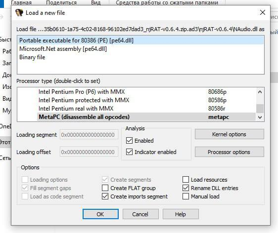
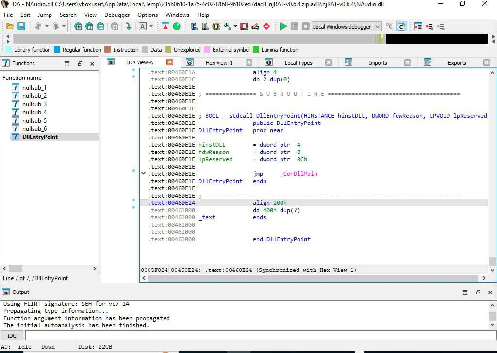

# Отчет по статическому анализу вредоносного ПО

## Ход работы

### 1. Получение и подготовка исследуемого образца

*Рисунок 1: Процесс подготовки исследуемого образца*

### 2. Статический анализ в IDA 

*Рисунок 2: Начало анализа в IDA *

*Рисунок 3: Детальный анализ механизма распаковки*

## Итоги

В ходе работы были освоены базовые приемы статического анализа в IDA Pro, изучены методы идентификации упакованного кода и проанализирован механизм работы распаковщика на актуальном примере современного вредоносного ПО.

---

